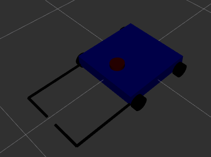
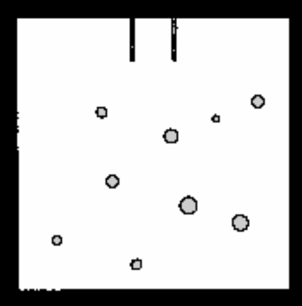

# ROS2 Ball‑Collecting Robot — goal_e

## Introduction
This project implements a ROS2‑based mobile robot designed to autonomously locate, approach, collect, and deliver three balls of different radii and colors to a designated goal area. Although the balls differ visually, the robot relies exclusively on LiDAR‑based geometric detection rather than color or image processing. The system integrates a custom URDF model, ros2_control hardware interfaces, SLAM‑based mapping, Nav2 navigation, and a two‑node automation system that separates detection from action. The robot platform consists of a four‑wheel base with differential‑drive movement and two front‑mounted L‑shaped arms that collect targets. Together, these components form an autonomous system capable of performing repeated ball‑collection cycles within a mapped environment. The system proved capable of completing the task, but with a low overall success rate of roughly 20% for collecting all three balls autonomously.

### Controls
The scripts have been organized into launch files. launch_sim spawns the bot in the world and the spheres. launch_slam Runs SLAM and Nav2 for mapping. launch_nav2 launches Nav2 with AMCL as necessary for autonomous movement. collect_balls runs the detechton and autonomous controller scripts.

**SLAM mode**
- `ros2 launch goal_e launch_sim.launch.py`
- `ros2 launch goal_e launch_slam.launch.py`

**Nav2 mode**
- `ros2 launch goal_e launch_sim.launch.py`
- `ros2 launch goal_e launch_nav2.launch.py`

**Automated Collector mode**
- `ros2 launch goal_e launch_sim.launch.py`
- `ros2 launch goal_e launch_nav2.launch.py`
- `ros2 launch goal_e collect_balls.launch.py`

## Objective
The primary objective is to autonomously collect three randomly spawned spheres, each with a different radius and color, and transport them to a predefined goal zone. Because the robot uses only a 2D LiDAR sensor, the system distinguishes balls solely through their geometric signatures in the LiDAR scan.

**Ball characteristics:**
- Three balls total  
- Three different radii  
- Three different colors  

The robot must detect each ball, compute an approach pose, collect it using the arms, and finally deliver all three to the goal area.

---

# System Implementation

## 1. URDF Model
Development began with the robot’s physical description using a modular Xacro‑based URDF. The URDF defines the chassis, wheels, arms, and sensor placement. A four‑wheel configuration was chosen for stability, with the rear wheels actuated through a differential‑drive setup and the front wheels acting as passive casters. This layout improves stability during collection, especially when the robot is carrying or pushing a load.

**Defined wheel joints:**
- `chassis_to_lf_wheel`  
- `chassis_to_lb_wheel`  
- `chassis_to_rf_wheel`  
- `chassis_to_rb_wheel`  

**Arm joints:**
- `chassis_to_arm1`  
- `chassis_to_arm2`  

The URDF also includes collision geometry, inertial parameters, and a LiDAR mounting point to support SLAM and detection.

The design maintains a lidar height of less than 0.2 m, which is the diameter of the smallest sphere, to maintain view of it. The arms are placed very low to allow a bigger window of error when picking up the largest ball.

---

## 2. ros2_control Integration
Once the URDF was finalized, ros2_control was integrated to provide hardware abstraction for both locomotion and arm actuation.

**Controllers used:**
- `diff_drive_controller` — rear wheel actuation  
- `joint_trajectory_controller` — arm opening/closing  

Odometry is derived solely from wheel encoders. While this is sufficient for short‑range maneuvers, it introduces drift during longer navigation sequences, which later contributed to alignment issues during autonomous ball collection.

Initially a position controller was used but the movement was very fast and threw the target away if they collided. Hence a trajectory controller was used to limit the speed.

---

## 3. SLAM Mapping
With the robot model and controllers operational, SLAM was implemented using SLAM Toolbox. The robot was teleoperated through the environment to build a 2D map. This map was then saved and used for localization during autonomous navigation.

The LiDAR‑only sensing configuration produced clean wall boundaries and stable localization, making SLAM one of the most reliable components of the system.

---

## 4. Nav2 Navigation
After mapping, the Nav2 stack was introduced to enable autonomous navigation. Nav2 handled global and local planning, obstacle avoidance, and recovery behaviors. The AMCL and costmap paramaters were tuned to fit the application, the others were mostly default Nav2 values.

Two modes of operation were used:

**Teleoperation mode:**
- Direct manual control  
- Highly precise alignment  
- Easily completes the full 3‑ball objective  
- Not affected by localization drift  

**Nav2 autonomous mode:**
- Works well in open areas  
- Struggles with precise alignment near small objects  
- Sensitive to odometry drift  

In practice, teleoperation consistently achieved the full objective, while Nav2 was significantly less successful due to the precision required for ball collection.

---

## 5. LiDAR‑Based Ball Detection (target_finder.py)
Ball detection was implemented using LiDAR‑based geometric clustering. Because no camera is used, the system relies entirely on the shape and size of LiDAR returns.

Points returned from the LiDAR that overlapped with occupied spaces on the map were rejected. The remaining points were clustered and their radii estimated. Since the LiDAR is at a fixed height, it perceives the target balls as having unique “apparent radii.” These values do not correspond to their real radii (0.1, 0.2, 0.3 m) but are slightly smaller because the LiDAR is not level with the ball centers. The perceived radii were measured experimentally and hardcoded. The script uses these to identify each ball and then calculates its center from the arc.

If one or more targets are not visible from the starting position, the script temporarily stores zeroes. When the robot moves, newly discovered targets replace the zeroes in order of discovery.

Once the center is calculated, two additional points are defined: **Approach** and **Pickup** (visible as black points in RViz).  
- The **approach point** is chosen as a location with low cost along the path to the ball center, weighted by proximity to the map origin.  
- The **pickup point** a small distance away from the center in the direction of the approach point. 

The approach point is fixed once found, but the center and pickup points are recalculated frequently.

The detection node:
- Subscribes to LiDAR scans  
- Identifies arc clusters  
- Estimates ball center positions  
- Computes approach and pickup poses  
- Publishes a pose array containing six poses  
- Updates positions when new targets are discovered  

This node does not command motion; it only provides geometric targets for the collection node.

---

## 6. Target Collection & Goal Placement (pos_commander.py)
The final stage of implementation was the collection and placement logic. The collection node subscribes to the approach poses generated by the detection node and uses Nav2 to navigate toward each ball. After collection, it navigates to a "goal approach" position, opens arms and moves to "goal place" position releasing the ball. These goal positions are hardcoded.

At the approach pose:
- The robot aligns with the ball  
- Arms open  
- The robot advances to the pickup pose  
- Arms close  

At the goal:
- Arms open  
- Robot pushes the ball into the goal opening  
- Arms close  

This process repeats until all three balls are collected. When the pose array (/ball_targets) is updated, the local array is immediately updated but no change is made to the navigation currently in progress.  

### Failure Conditions
Several conditions frequently caused the system to fail:

**Detection‑related failures:**
- Balls too close to walls or obstacles  
- Balls moving or rolling after detection  
- Robot accidentally collides with targets
- Odom drifting just before pickup

---

## Discussion
Initially, the robot attempted to enter the goal area, drop the ball, and retreat. This failed because the open arms collided with other balls and sometimes pulled them out. The final approach involved pushing the balls into the goal from outside, which proved more reliable.

The original collection order was fixed (red, green, blue). This caused issues when the green or blue balls blocked the goal opening. The target finder was updated to prioritize balls closest to the goal entrance instead.

It was also observed that the laser scan tends to drift when turning but corrects itself when moving straight. Because of this, approach points were defined to be farther away than necessary, giving AMCL time to correct the scan offset before reaching the target and accidentally knocking it away.

The arms rotate past 90 degrees to accomodate the largest sphere, but this may cause the outward arms to hit obstacles. An improvement to the system may be to only open past 90 degrees for the largest ball and maintain 90 degrees for the others.

Overall, the project demonstrates a complete ROS2 robotics system integrating URDF modeling, ros2_control hardware abstraction, SLAM‑based mapping, Nav2 navigation, and custom LiDAR‑based detection and manipulation logic. While the robot successfully performs mapping, navigation, teleoperation, and basic ball‑collection behaviors, the fully autonomous pipeline achieved only partial success. Teleoperation reliably completes the task, but Nav2 struggles with the precision required for interacting with small, movable objects. Despite these challenges, the system provides a functional prototype and a strong foundation for future improvements in detection, localization, and manipulation.

## Links
- [GitHub Repository](https://github.com/LokiofAdgard/goal_e.git)
- [Demonstration Video]()

## References
- [URDF tutorial](https://docs.ros.org/en/humble/Tutorials/Intermediate/URDF/URDF-Main.html)
- [ros2_control Documentation](https://control.ros.org/rolling/index.html)  
- [Nav2 YouTube Guide](https://www.youtube.com/watch?v=jkoGkAd0GYk&t=379s)  
- [Nav2 Documentation](https://docs.nav2.org/)  
- ChatGPT was used to implement calculations for target detection  
